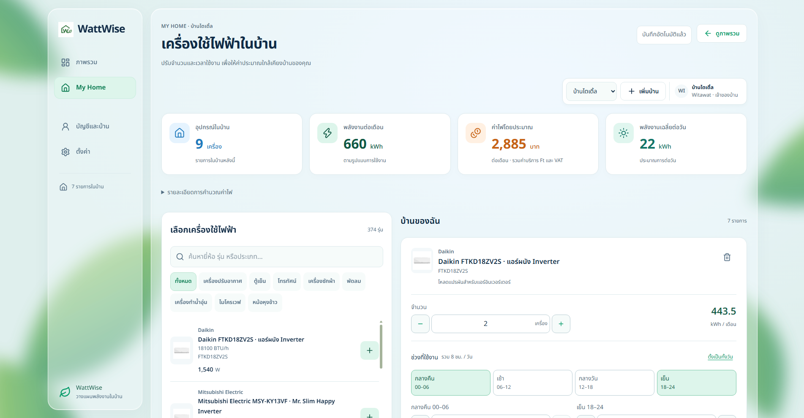
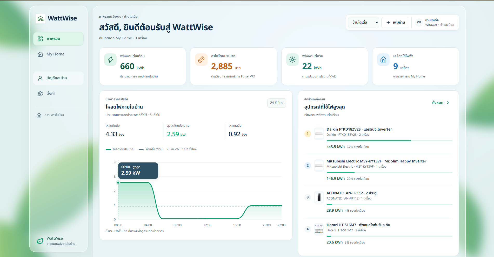

# WattWise ⚡

WattWise คือเว็บแอปสำหรับสร้าง “บ้านจำลองด้านพลังงาน” จากเครื่องใช้ไฟฟ้ารุ่นจริง แล้วดูการใช้ไฟและค่าไฟโดยประมาณของบ้านได้ในที่เดียว

เหมาะสำหรับคนที่อยากลองตอบคำถามง่าย ๆ เช่น “ถ้าเพิ่มแอร์อีกเครื่อง ค่าไฟจะขึ้นประมาณเท่าไร?” หรือ “เครื่องใช้ไฟฟ้าชิ้นไหนใช้พลังงานมากที่สุดในบ้าน?”

## ตัวอย่างหน้าจอ

### My Home — จัดการเครื่องใช้ไฟฟ้าในบ้าน



### Dashboard — ดูภาพรวมการใช้พลังงาน



## ฟีเจอร์หลัก

- 🔎 ค้นหาและกรองเครื่องใช้ไฟฟ้าจาก catalog ตามชื่อ รุ่น หรือหมวดหมู่
- 🏠 เพิ่มเครื่องใช้ไฟฟ้าเข้าบ้านด้วยปุ่มเพิ่มบนการ์ดอุปกรณ์
- ⚙️ ตั้งค่าจำนวนเครื่อง ชั่วโมงใช้งานต่อวัน วันใช้งานต่อเดือน และช่วงเวลาใช้งาน
- 📊 ดูพลังงานรวม โหลดไฟฟ้า และค่าไฟโดยประมาณแบบอัปเดตทันที
- 🧮 รองรับการคำนวณหลายรูปแบบ เช่น rated power, per-cycle, annual energy และ variable load
- 👥 จัดการหลายบ้านและสมาชิกในบ้าน พร้อม role `owner`, `admin`, `member` และ `viewer`
- 💾 บันทึกข้อมูลบ้านและรายการเครื่องใช้ไฟฟ้าอัตโนมัติแยกตามผู้ใช้และบ้าน
- 📚 ใช้ catalog เครื่องใช้ไฟฟ้าที่มีข้อมูลรุ่น แหล่งที่มา วันที่ตรวจสอบ และระดับความเชื่อมั่นของข้อมูล

ปัจจุบัน catalog มีเครื่องใช้ไฟฟ้าที่คัดสรรไว้ 374 รุ่น โดยรวมรุ่นจาก EGAT Label No.5 และรุ่น legacy ที่ยังจำเป็นต่อความเข้ากันได้ของข้อมูลบ้านเดิม

## วิธีใช้งานโดยย่อ

1. เลือกหรือสร้างบ้านที่ต้องการจัดการ
2. ค้นหาเครื่องใช้ไฟฟ้าจาก catalog แล้วเพิ่มเข้าไปในบ้าน
3. ปรับจำนวนและรูปแบบการใช้งานให้ใกล้เคียงกับการใช้งานจริง
4. ดูสรุป kWh ต่อเดือน ค่าไฟโดยประมาณ และอุปกรณ์ที่ใช้ไฟมากที่สุด
5. กลับมาแก้ไขข้อมูลภายหลังได้ ระบบจะบันทึกข้อมูลให้ตามบ้านที่เลือก

## การคำนวณและข้อควรรู้

ผลลัพธ์ใน WattWise เป็น “ค่าประมาณ” เพื่อช่วยวางแผนและเปรียบเทียบการใช้งาน ไม่ใช่ตัวเลขจากมิเตอร์จริง และไม่ควรใช้แทนใบแจ้งค่าไฟ

- usage profile เป็นค่ามาตรฐานตามประเภทอุปกรณ์ จึงอาจแตกต่างจากการใช้งานจริง
- ค่าไฟคำนวณตาม tariff บ้านอยู่อาศัยที่มีข้อมูลช่วงวันที่มีผล รวมค่าไฟฐาน ค่าบริการ Ft และ VAT ตามข้อมูลที่ระบบรองรับ
- รุ่นที่เผยแพร่ใน catalog ควรมีแหล่งข้อมูลและวันที่ตรวจสอบกำกับไว้
- ข้อมูลจาก prototype เดิมจะอยู่ในสถานะ quarantine จนกว่าจะผ่านการตรวจสอบและ claim อย่างชัดเจน

## เริ่มต้นใช้งาน

### สิ่งที่ต้องมี

- Node.js `>= 22.13.0`
- npm

### ติดตั้งและรันในโหมดพัฒนา

```bash
npm ci
npm run dev
```

ถ้าใช้ Windows สามารถใช้สคริปต์ที่เตรียมไว้ได้ด้วย:

```powershell
.\scripts\dev.ps1
```

จากนั้นเปิด URL ที่แสดงใน terminal

### สร้าง production build

```bash
npm run build
npm start
```

## คำสั่งที่ใช้บ่อย

| คำสั่ง | ใช้ทำอะไร |
| --- | --- |
| `npm run dev` | เปิด development server |
| `npm run build` | สร้าง production build |
| `npm start` | รัน build ที่สร้างไว้ |
| `npm test` | รันชุดทดสอบ calculation engine |
| `npm run lint` | ตรวจรูปแบบและปัญหาในโค้ด |
| `npm run typecheck` | ตรวจ TypeScript โดยไม่สร้างไฟล์ output |
| `npm run check:icons` | ตรวจการใช้ไอคอนใน UI |

ก่อนเปิด Pull Request แนะนำให้รันชุดตรวจสอบหลักให้ครบ:

```bash
npm test
npm run lint
npm run typecheck
npm run build
```

## Tech stack

- TypeScript
- React 19
- Next.js-compatible App Router ผ่าน Vinext
- Vite
- Cloudflare Workers และ D1/SQLite
- Drizzle ORM
- Lucide React สำหรับไอคอนใน UI

## โครงสร้างโปรเจกต์

```text
app/                 หน้าเว็บและ API routes
components/          UI components ที่ใช้ร่วมกัน
db/schema.ts         โครงสร้างฐานข้อมูล D1/SQLite
lib/                 calculation engine, catalog และ household logic
public/              โลโก้ รูปสินค้า และ static assets
scripts/             สคริปต์สำหรับ development และ deployment workflow
tests/               ชุดทดสอบของระบบคำนวณ
docs/                เอกสารด้านข้อมูล การตัดระบบ และ QA
```

## เอกสารที่เกี่ยวข้อง

- [`PROJECT_SPEC.md`](./PROJECT_SPEC.md) — วิสัยทัศน์ ขอบเขต และ acceptance criteria
- [`CONTRIBUTING.md`](./CONTRIBUTING.md) — workflow สำหรับพัฒนาและส่ง Pull Request
- [`docs/catalog.md`](./docs/catalog.md) — ที่มาของ catalog และสัญญา Catalog API
- [`docs/multi-user-cutover.md`](./docs/multi-user-cutover.md) — ขั้นตอนย้ายข้อมูลเดิมเข้าสู่ระบบหลายผู้ใช้
- [`docs/ui-redesign-qa.md`](./docs/ui-redesign-qa.md) — checklist สำหรับตรวจสอบ UI

## สถานะโปรเจกต์

ฟีเจอร์หลักสำหรับ catalog, การสร้างบ้านจำลอง, dashboard, การคำนวณพลังงาน และการจัดการ household มีโครงสร้างพร้อมใช้งานแล้ว โดยระบบยังอยู่ระหว่างการพัฒนาต่อในส่วนของข้อมูล tariff, scenario comparison และคำแนะนำประหยัดไฟ

หากพบปัญหาหรือมีไอเดียเพิ่มเติม สามารถเปิด Issue หรืออ่านแนวทางการมีส่วนร่วมได้ที่ [`CONTRIBUTING.md`](./CONTRIBUTING.md)
